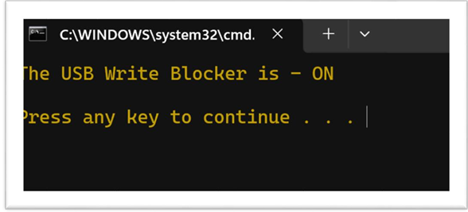
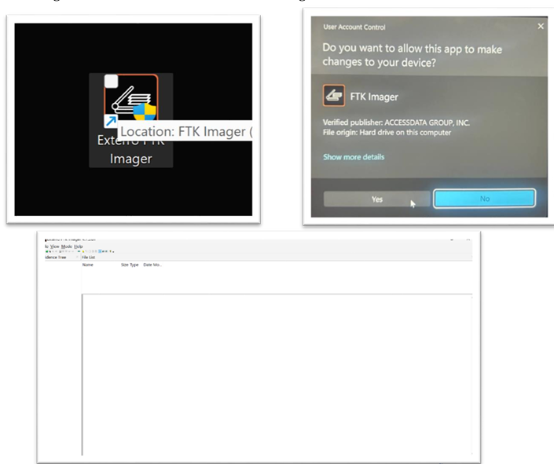
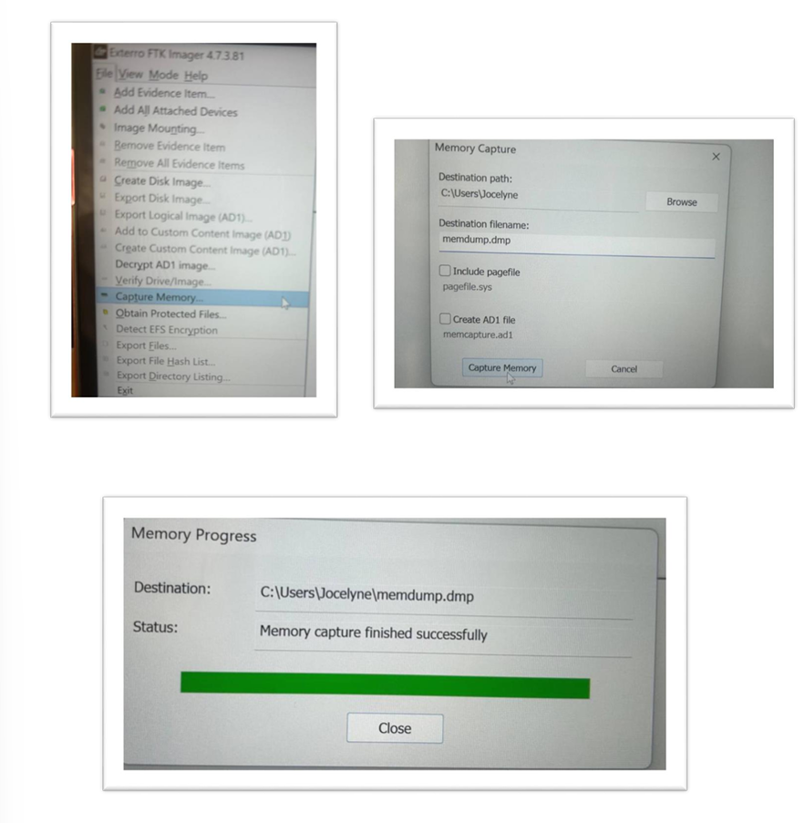
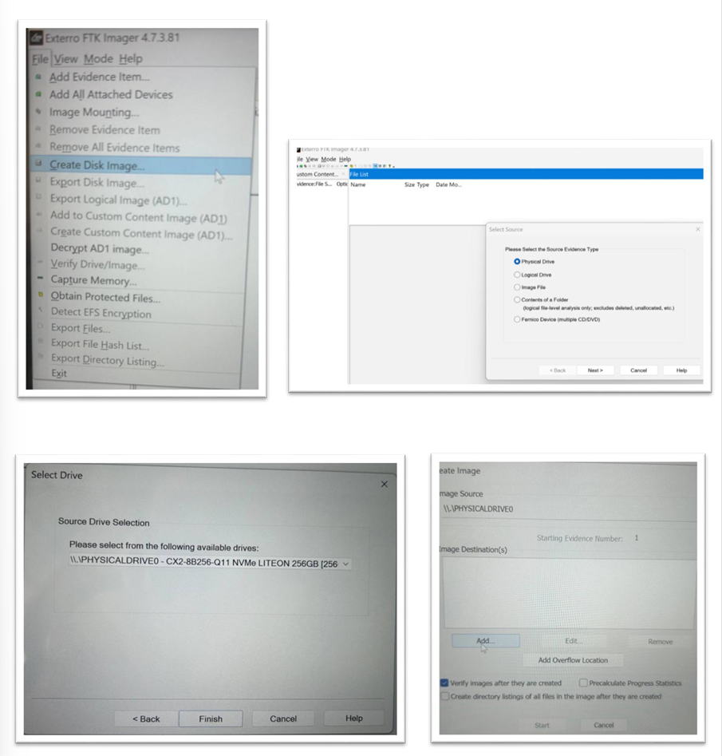
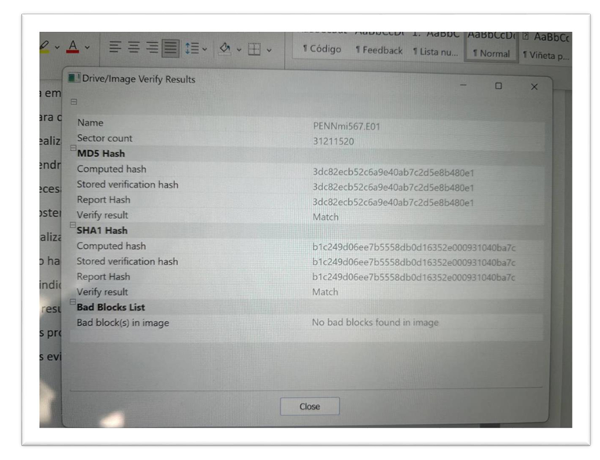

# 🕵️‍♀️ Adquisición de Evidencias Digitales / Digital Evidence Acquisition  

## 🧭 Introducción / Introduction  

**ES:**  
La adquisición de evidencia digital es un paso crítico en la investigación de incidentes cibernéticos. Este informe detalla los procedimientos utilizados para obtener dispositivos externos y realizar una adquisición en caliente sin comprometer la integridad.

**EN:**  
Digital evidence acquisition is a critical step in cyber incident investigations. This report outlines procedures used to acquire external devices and conduct live acquisition without compromising integrity.

---

## ⚙️ Procedimientos Realizados / Procedures Performed  

### 🖴 1. Adquisición de dispositivo externo / External Device Acquisition  

**ES:**  
- Conexión de pendrive al sistema  
- Activación de bloqueo contra escritura  
- Imagen del dispositivo con FTK Imager  
- Generación de hash MD5/SHA-1  

**EN:**  
- USB drive connected to the system  
- Write-blocker software activated  
- Device image acquired using FTK Imager  
- MD5/SHA-1 hash generation  

---

### 🖥 2. Adquisición en caliente / Live Acquisition  

**ES:**  
- Uso de FTK Imager para RAM y disco duro  
- Configuración de disco como solo lectura  
- Imagen bit a bit almacenada en pendrive  
- Evidencia guardada en disco externo con protección  

**EN:**  
- FTK Imager used for RAM and hard disk  
- Disk set to read-only mode  
- Bit-by-bit image saved to USB drive  
- Evidence stored on write-protected external disk  

---

## 🛡 Precauciones Tomadas / Precautions Taken  

**ES:**  
- Entorno controlado  
- Documentación de cada paso  
- Cierre de aplicaciones no esenciales  
- Uso de herramientas confiables y certificadas  

**EN:**  
- Controlled environment  
- Step-by-step documentation  
- Closing non-essential applications  
- Certified and trusted tools used  

---

## ✅ Conclusiones / Conclusions  

**ES:**  
El proceso exigió precisión y cuidado para garantizar la integridad. El conocimiento aplicado y el uso de buenas prácticas permitieron resultados confiables.

**EN:**  
The process required precision and care to ensure data integrity. Applied knowledge and sound practices enabled reliable results.

## 🖼️ Evidencias Visuales / Visual Evidence

### 🔒 Bloqueo contra escritura / Write-block Activation  

### ⚙️ Configuración de FTK Imager / FTK Imager Setup  

### 💾 Adquisición de RAM / RAM Acquisition  

### 🧮 Imagen de disco en vivo / Live Disk Acquisition  

### 🔐 Verificación de integridad / Hash Verification  

 
