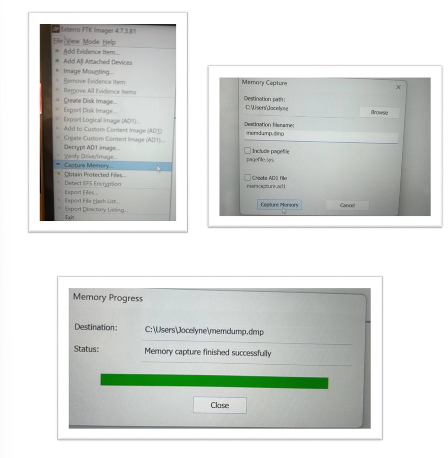

# DigitalEvidenceAcquisition_ES_EN
Academic forensic acquisition practice with FTK Imager
# 🧪 Digital Evidence Acquisition / Adquisición de Evidencia Digital

## 🇺🇸 English Version

I’m a Bilingual Technical Support Analyst and cybersecurity student with experience in remote support, technical documentation, and digital forensic analysis. I excel at breaking down complex scenarios into clear, structured steps and creating reusable bilingual resources for global teams. My strengths lie in collaborative environments, well-defined processes, and precise documentation as a tool for continuous improvement. I’m currently transforming academic projects into practical GitHub examples, focusing on forensic evidence acquisition, log analysis, and Blue Team best practices.

### 🎯 Purpose  
This repository documents the practical application of digital evidence acquisition procedures as part of academic cybersecurity training. It simulates real-world incident response tasks using trusted forensic tools.

### 🛠 Tools Used  
- FTK Imager v4.7.3.81  
- USB write blockers  
- Hashing algorithms: MD5 and SHA-1
  
### 🔍 Procedures Included  
- Acquisition of external storage device with write-block enabled  
- Live acquisition from running system (RAM + disk image)  
- Integrity verification using hash comparison (pre/post)

### 📁 Folder Structure

| Folder             | Contents                                               |
|--------------------|--------------------------------------------------------|
| `/docs/`           | Step-by-step procedures in English and Spanish         |
| `/assets/`         | Screenshots of tools, configurations, and hash reports |         |
| `/README.md`       | Bilingual project overview                             |

### 📌 Integrity Focus  
All acquisition steps follow best forensic practices:
- No alteration of original evidence
- Secure storage with write-blockers
- Verified hash matching to prove data integrity

### 📚 Related Topics  
Digital forensics, incident response, evidence handling, hash verification, memory capture, disk imaging.

---

## 🇪🇸 Versión en Español

Soy Analista de Soporte Técnico Bilingüe y estudiante de ciberseguridad con experiencia en asistencia remota, documentación técnica, y análisis forense digital. Destaco por mi capacidad para descomponer escenarios complejos en pasos claros y estructurados, así como crear recursos bilingües reutilizables para equipos globales. Me especializo en entornos colaborativos, procesos bien definidos y documentación precisa como herramienta de mejora continua. Actualmente transformo mis proyectos académicos en ejemplos prácticos alojados en GitHub, enfocándome en evidencia forense, análisis de logs y buenas prácticas del Blue Team.

### 🎯 Propósito  
Este repositorio documenta la aplicación práctica de los procedimientos de adquisición de evidencia digital como parte del entrenamiento académico en ciberseguridad. Simula tareas reales de respuesta a incidentes utilizando herramientas forenses confiables.

### 🛠 Herramientas Utilizadas  
- FTK Imager v4.7.3.81  
- Bloqueadores de escritura USB  
- Algoritmos de hash: MD5 y SHA-1

### 🔍 Procedimientos Incluidos  
- Adquisición de dispositivo externo con protección contra escritura  
- Adquisición en caliente (RAM + disco duro en funcionamiento)  
- Verificación de integridad mediante comparación de hashes (antes/después)

### 📁 Estructura de Carpetas

| Carpeta             | Contenido                                                |
|---------------------|----------------------------------------------------------|
| `/docs/`            | Procedimientos paso a paso en español e inglés           |
| `/assets/`          | Capturas de pantalla de herramientas y reportes de hash  |
| `/README.md`        | Descripción bilingüe del proyecto                        |

### 📌 Enfoque en Integridad  
Todos los pasos siguen las mejores prácticas forenses:
- No alteración de evidencia original  
- Almacenamiento seguro con bloqueadores de escritura  
- Verificación de coincidencia hash para garantizar integridad

### 📚 Temas Relacionados  
Informática forense, respuesta a incidentes, manejo de evidencias, verificación hash, captura de memoria, imagen de disco.

## 🖼️ Evidencias Visuales / Visual Evidence

### 🔒 Bloqueo contra escritura / Write-block Activation  

### ⚙️ Configuración de FTK Imager / FTK Imager Setup  

### 💾 Adquisición de RAM / RAM Acquisition  

### 🧮 Imagen de disco en vivo / Live Disk Acquisition  

### 🔐 Verificación de integridad / Hash Verification  

